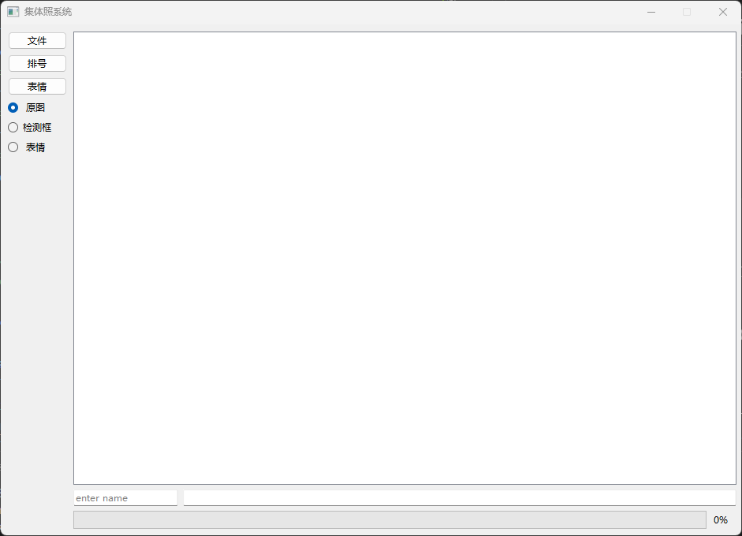

---
# 详细文档见https://modelscope.cn/docs/%E5%88%9B%E7%A9%BA%E9%97%B4%E5%8D%A1%E7%89%87
domain: #领域：cv/nlp/audio/multi-modal/AutoML
# - cv
tags: #自定义标签
-
datasets: #关联数据集
  evaluation:
  #- iic/ICDAR13_HCTR_Dataset
  test:
  #- iic/MTWI
  train:
  #- iic/SIBR
models: #关联模型
#- iic/ofa_ocr-recognition_general_base_zh

## 启动文件(若SDK为Gradio/Streamlit，默认为app.py, 若为Static HTML, 默认为index.html)
# deployspec:
#   entry_file: app.py
license: Apache License 2.0
---
#### Clone with HTTP
```bash
 git clone https://www.modelscope.cn/studios/sihan733/group_photo.git
```

## 本项目基于赵卫东老师的集体照代码
1. 使用pyside6替换gradio提供更加友好的UI
2. 支持交互友好的抠图
3. 人脸检测
4. 人脸识别
5. 排号检测
6. 人像分割
7. 闭眼检测
8. 表情识别
   
## 环境配置
### 建议先创建虚拟环境
1. conda create -n mmdet python=3.8 -y
2. conda activate mmdet

### 安装 PyTorch（根据您的 CUDA 版本选择）
### 例如对于 CUDA 11.3
3. pip install torch==1.10.0+cu113 torchvision==0.11.0+cu113 -f https://download.pytorch.org/whl/torch_stable.html

### 安装 MMCV
4. pip install mmcv-full==1.4.0 -f https://download.openmmlab.com/mmcv/dist/cu113/torch1.10.0/index.html

### 安装 MMDetection
5. pip install mmdet==2.20.0

6. pip install -r requirements.txt
## 运行
1. python app.py
   
## 操作
1. 选择图片: 选定图片后，程序会对图片进行人脸检测和人脸识别以及排号检测。
2. 图片载入完成后点击检测框即可以显示人脸检测结果
3. 点击排号可以显示检测到的排号
4. 鼠标滚轮可以对图片进行放大和缩小，鼠标右键可以还原原图视角
5. 鼠标左键单击任意一张人脸框，可以进行人像分割
6. 点击表情可以进行表情识别和闭眼检测

## 贡献
1. 本项目基于赵卫东老师的集体照代码，感谢赵卫东老师开源的代码
2. 本项目人像分割部分代码由潘缘进行提供
3. 本项目表情识别和闭眼检测部分由余盛龙提供
   
## QA
Q:cannot import name ‘OfflineModeIsEnabled‘ from ‘datasets.utils.file_utils‘
A:pip install datasets==2.16.0
